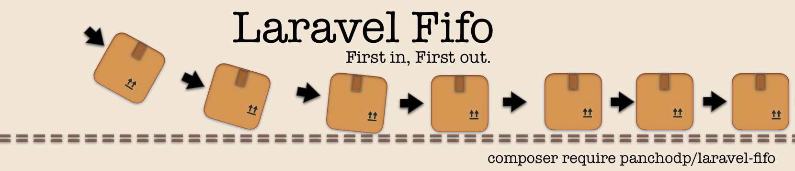

<p align="center"><a target="_blank"> </a></p>

<p align="center">
<a ></a>
<a ></a>
<a href="https://packagist.org/packages/panchodp/laravel-fifo"></a>
<a href="https://packagist.org/packages/panchodp/laravel-fifo"></a>
<a href="https://github.com/PanchoDP/laravel-fifo/actions/workflows/tests.yml"></a>
</p>


# Laravel Fifo

Laravel package for inventory management using FIFO (First In, First Out) methodology.

## What is FIFO?

FIFO (First In, First Out) is an inventory valuation method where the first items purchased are the first items sold. This method is essential for:

- **Accurate cost calculation**: Ensures older inventory costs are used first
- **Financial reporting**: Provides realistic inventory valuations
- **Perishable goods**: Natural fit for items with expiration dates
- **Inflation periods**: Shows current market prices in cost of goods sold

### How FIFO Works

When you sell inventory, FIFO calculates the cost using the oldest purchases first:

1. **Purchase**: Record items with their unit costs
2. **Sale**: Calculate cost using oldest inventory first 
3. **Valuation**: Remaining inventory reflects recent purchase prices

**Example:**
- Buy 100 units at $10 each (Total: $1,000)
- Buy 50 units at $12 each (Total: $600)
- Sell 120 units → Cost: (100 × $10) + (20 × $12) = $1,240
- Remaining: 30 units at $12 each = $360

## Installation

You can install the package via composer:

```bash
composer require panchodp/laravel-fifo
```

Install the package (publishes config and migrations):

```bash
php artisan fifo:install
```

Run the migrations:

```bash
php artisan migrate
```

### Alternative Installation

You can also publish files individually:

```bash
# Publish the config file
php artisan vendor:publish --provider="LaravelFifo\Providers\LaravelFifoServiceProvider" --tag="laravel-fifo-config"

# Publish the migrations
php artisan vendor:publish --provider="LaravelFifo\Providers\LaravelFifoServiceProvider" --tag="laravel-fifo-migrations"
```

## Configuration

### Product Model

You must configure the Product model that will be used by the FIFO system. In your `config/fifo.php` file:

```php
'product_model' => App\Models\Product::class,
```

Or set it in your `.env` file:

```
FIFO_PRODUCT_MODEL=App\Models\Product
```

### Product Model Requirements

Your Product model must:
- Have an `id` column (primary key)
- Extend `Illuminate\Database\Eloquent\Model`

### Adding Relationship to Your Product Model

Add the following relationship to your Product model:

```php
<?php

namespace App\Models;

use Illuminate\Database\Eloquent\Model;
use Illuminate\Database\Eloquent\Relations\HasMany;
use LaravelFifo\Models\FifoTransaction;

class Product extends Model
{
    // Your existing code...
    
    /**
     * Get the FIFO transactions for this product.
     */
    public function fifoTransactions(): HasMany
    {
        return $this->hasMany(FifoTransaction::class);
    }
}
```

## Understanding the Data Structure

### FifoTransaction Model

The `FifoTransaction` model represents each inventory movement with the following fields:

| Field | Type | Description |
|-------|------|-------------|
| `id` | integer | Primary key |
| `product_id` | integer | Foreign key to your Product model |
| `type` | enum | Transaction type: `'in'` (purchase) or `'out'` (sale) |
| `quantity` | decimal | Number of units |
| `unit_price` | decimal | **Important**: See semantics below |
| `total_amount` | decimal | `quantity × unit_price` |
| `transaction_date` | timestamp | When the transaction occurred |
| `reference` | string | Optional reference (PO number, invoice, etc.) |

### unit_price Semantics

The `unit_price` field has different meanings depending on the transaction type:

- **Inbound transactions (`type = 'in'`)**: Represents the **unit cost** of purchasing the item
- **Outbound transactions (`type = 'out'`)**: Represents the **FIFO-calculated weighted average cost** of the items being sold

This design maintains consistency while providing accurate cost tracking through the FIFO methodology.

## When to Use Laravel FIFO

### Ideal Use Cases

- **E-commerce**: Track product costs across multiple purchase orders
- **Manufacturing**: Calculate raw material costs using oldest inventory first

### Benefits

- **Accurate Financial Reporting**: Provides realistic cost of goods sold
- **Inflation Management**: Current inventory reflects recent purchase prices
- **Automated Calculations**: No manual cost tracking required
- **Audit Trail**: Complete transaction history for each product

## Usage

### Using the Fifo Facade

#### Register Inbound Transaction (Stock In)

```php
use LaravelFifo\Facades\Fifo;

$success = Fifo::registerInbound(
    productId: 1,
    quantity: 100.0,
    unitPrice: 10.50,
    reference: 'PO-001' // optional
);

if ($success) {
    echo "Inbound transaction registered successfully";
} else {
    echo "Failed to register inbound transaction";
}
```

#### Register Outbound Transaction (Stock Out)

```php
use LaravelFifo\Facades\Fifo;

$result = Fifo::registerOutbound(
    productId: 1,
    quantity: 50.0,
    reference: 'SO-001' // optional
);

if ($result['success']) {
    echo "Transaction ID: " . $result['transaction_id'];
    echo "FIFO Price: $" . $result['fifo_price'];
} else {
    echo "Error: " . $result['error'];
}
```

## Complete Example: Purchase → Sale → Cost Calculation

Here's a complete workflow demonstrating FIFO in action:

```php
use LaravelFifo\Facades\Fifo;

// Step 1: Record purchases (inbound transactions)
Fifo::registerInbound(productId: 1, quantity: 100, unitPrice: 10.00, reference: 'PO-001');
Fifo::registerInbound(productId: 1, quantity: 50, unitPrice: 12.00, reference: 'PO-002');

// Current inventory: 150 units
// - 100 units at $10.00 each
// - 50 units at $12.00 each
// Total value: $1,600

echo "Available stock: " . Fifo::getAvailableStock(1); // 150.00
echo "Inventory value: $" . Fifo::getCurrentInventoryValue(1); // 1600.00

// Step 2: Make a sale (outbound transaction)
$sale = Fifo::registerOutbound(productId: 1, quantity: 120, reference: 'SO-001');

if ($sale['success']) {
    echo "Sale completed:";
    echo "- Units sold: 120";
    echo "- FIFO cost per unit: $" . $sale['fifo_price']; // 10.33
    echo "- Total cost: $" . (120 * floatval($sale['fifo_price'])); // 1,240.00
}

// Step 3: Check remaining inventory
echo "Remaining stock: " . Fifo::getAvailableStock(1); // 30.00
echo "Remaining value: $" . Fifo::getCurrentInventoryValue(1); // 360.00

// FIFO Calculation explanation:
// Sale of 120 units uses:
// - 100 units at $10.00 = $1,000
// - 20 units at $12.00 = $240
// - Total cost: $1,240
// - Average cost: $1,240 ÷ 120 = $10.33 per unit
//
// Remaining inventory:
// - 30 units at $12.00 = $360
```

#### Stock Information Methods

```php
use LaravelFifo\Facades\Fifo;

// Get available stock
$stock = Fifo::getAvailableStock(1);
echo "Available stock: {$stock}";

// Get FIFO price for specific quantity
$price = Fifo::fifoPrice(1, 25.0);
echo "FIFO price for 25 units: ${price}";

// Get current inventory value
$value = Fifo::getCurrentInventoryValue(1);
echo "Current inventory value: ${value}";

// Get detailed stock by batch
$batches = Fifo::calculateStockByBatch(1);
foreach ($batches as $batch) {
    echo "Batch {$batch['transaction_id']}: {$batch['available_quantity']} units at ${batch['unit_price']}";
}
```

### Understanding calculateStockByBatch() Return Value

The `calculateStockByBatch()` method returns an array of available inventory batches, ordered by FIFO (oldest first). Each batch contains:

```php
[
    'transaction_id' => 123,           // ID of the original purchase transaction
    'unit_price' => 10.50,           // Unit cost from the original purchase
    'original_quantity' => 100.0,    // Original purchased quantity
    'available_quantity' => 75.0,    // Remaining quantity after sales
    'transaction_date' => Carbon     // Purchase date/time
]
```

**Example with Multiple Batches:**

```php
// After some purchases and sales:
$batches = Fifo::calculateStockByBatch(1);

// Returns:
// [
//     [
//         'transaction_id' => 1,
//         'unit_price' => 10.00,
//         'original_quantity' => 100.0,
//         'available_quantity' => 25.0,    // 75 units were sold
//         'transaction_date' => '2024-01-01 10:00:00'
//     ],
//     [
//         'transaction_id' => 2,
//         'unit_price' => 12.00,
//         'original_quantity' => 50.0,
//         'available_quantity' => 50.0,    // No units sold from this batch yet
//         'transaction_date' => '2024-01-02 14:30:00'
//     ]
// ]

// This tells us:
// - Oldest batch (ID 1): 25 units left at $10.00 each
// - Newest batch (ID 2): 50 units left at $12.00 each
// - Total available: 75 units
// - Next sale will use the remaining 25 units from batch 1 first
```

#### Product Management

```php
use LaravelFifo\Facades\Fifo;

// Delete product (only if no transactions)
$result = Fifo::deleteProduct(1);
if (!$result['success']) {
    echo $result['error'];
}

// Force delete product and all transactions
$result = Fifo::forceDeleteProduct(1);
if ($result['success']) {
    echo "Deleted {$result['deleted_transactions']} transactions";
}
```

## License

[MIT](https://github.com/PanchoDP/laravel-fifo/blob/master/LICENSE.md)